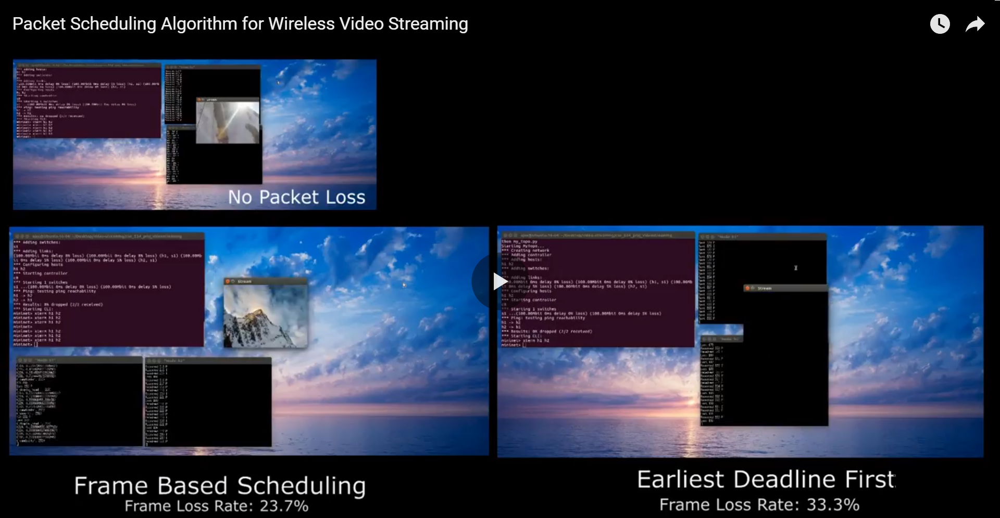

# Packet_Scheduling_for_Video_Streaming
Re-implementation of Packet Scheduling Algorithm for Wireless Video Streaming
[More detailed report is here](./demo/Final_Report.pdf)
Introduction
The project is intended to re-implement the packet scheduling algorithm for wireless video streaming as mentioned in the paper of Sang Kang and Avideh Zakhor. Traditionally, the most commonly used scheduling mothed is the earliest deadline first scheduling(EDF), which sends video frame packets sequentially in order of the deadline. Under good network connections, EDF is efficient in terms of minimizing required buffer size at the receiver side because the packets always arrive in order and the receiver does not need to have a large buffer. However, the performance of EDF is limited under error prone connections, for it does not handle importance of data in compressed video stream.

In section 2 of the report, the video encoding technique and the limitation of EDF are explained in detail. The paper introduces a new frame based packet scheduling algorithms(FBS) for MPEG-4 encoded video frames to mitigate the issue of EDF. The new algorithm can preserve video streaming quality by reordering transmission schedule based on the importance of each video frame. Section 3 introduces FBS algorithm and explains how the network environment is set up and how FBS is implemented in this project. In Section 4, the performance of EDF and FBS are evaluated and compared with various loss metrics. The evaluation has shown that in general FBS is able to transmit more important frames than EDF. With a low loss rate, FBS behaves similarly to EDF. However, with a very high loss rate, FBS only sends the most important frames and tends to ignore other frames. Also, because FBS adds the retransmission mechanism, there are a lot more retransmissions with highly lossy connections than with good connections.

